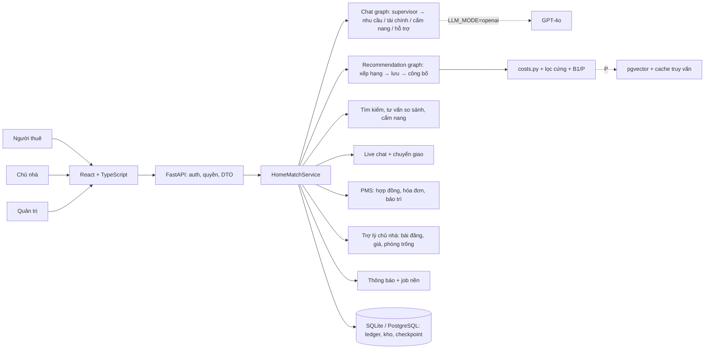
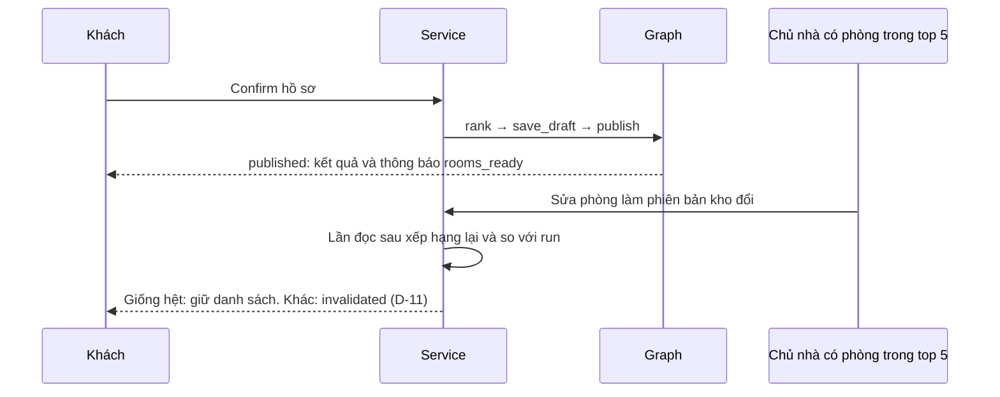

# Kiến trúc HomeMatch (schema v24)

Tài liệu này mô tả code hiện có. Kiến trúc agent chi tiết ở [thiet-ke-agent.md](thiet-ke-agent.md).

## Thành phần

```mermaid
flowchart LR
  R[Người thuê] --> FE[React + TypeScript]
  O[Chủ nhà] --> FE
  A[Quản trị] --> FE
  FE --> API[FastAPI: auth, quyền, DTO]
  API --> S[HomeMatchService]
  S --> C[Chat graph: supervisor → nhu cầu / tài chính / cẩm nang / hỗ trợ]
  S --> G[Recommendation graph: xếp hạng → lưu → công bố]
  S --> T[Tìm kiếm, tư vấn so sánh, cẩm nang]
  S --> L[Live chat + chuyển giao]
  S --> P[PMS: hợp đồng, hóa đơn, bảo trì]
  S --> K[Trợ lý chủ nhà: bài đăng, giá, phòng trống]
  S --> N[Thông báo + job nền]
  C -. LLM_MODE=openai .-> GPT[GPT-4o]
  G --> F[costs.py + lọc cứng + B1/P]
  F -. P .-> V[pgvector + cache truy vấn]
  S --> DB[(SQLite / PostgreSQL: ledger, kho, checkpoint)]
```

| Module backend | Vai trò |
|---|---|
| `main.py` | Route, auth bearer, luồng job nền (`HOMEMATCH_JOBS_INTERVAL_SECONDS`) |
| `service.py` | Quy tắc nghiệp vụ, kiểm vai trò và quyền bản ghi, gửi thông báo, hai graph LangGraph |
| `agents.py` | `ToolBox`: danh sách tool theo agent (needs, finance, ranking, support, handbook), tối đa 4 bước |
| `catalog.py`, `costs.py`, `locations.py`, `semantic.py` | Kho và lọc cứng, B1/P; tiền và vay; tên khu vực; embedding và cache |
| `repository.py` | Phiên, hồ sơ, run, lịch xem |
| `listings.py`, `advisor.py`, `handbook.py` | Tìm theo bộ lọc, tư vấn so sánh, cẩm nang |
| `conversations.py`, `notifications.py`, `automation.py` | Live chat và che PII, thông báo chống trùng, job định kỳ |
| `pms.py`, `copilot.py` | Hợp đồng, công tơ, hóa đơn, thanh toán, bảo trì, dashboard; bài đăng, giá, cố vấn |
| `memory.py`, `auth.py`, `organizations.py`, `capabilities.py`, `agent_capability.py` | Memory có đồng ý; tài khoản (kể cả chủ nhà tự đăng ký chờ admin duyệt); đơn vị và audit; ma trận quyền |
| `media.py`, `promotions.py`, `cost_metrics.py` | Ảnh tin và ảnh sự cố (file theo hash tại `HOMEMATCH_MEDIA_DIR`, kiểm magic bytes); ưu đãi chủ nhà (không vào xếp hạng); chi phí vận hành quy VND cho `/admin/metrics` |
| `routes_map.py` | Chỉ đường căn → điểm neo (MP-01): Goong Direction → OSRM công khai → đường chim bay; cache và hạn mức trong process |

## Vai trò

Có ba vai trò nghiệp vụ: `renter` (khách), `owner` (chủ nhà), `admin`. Phòng thuộc chủ nhà qua `Room.landlord_id`; phòng không có giá trị này mặc định thuộc `owner2`. Vai `manager` đã bỏ ngày 15/11/2026 cùng các tài khoản seed cũ (migration 24).

## Dữ liệu

| Nhóm | Bảng |
|---|---|
| Tài khoản, đơn vị | `hm_users`, `hm_tokens`, `hm_account_profiles` (v10: `landlord_status`, v14: `contact_phone` do chủ nhà tự khai), `hm_verification_tokens`, `hm_organizations`, `hm_memberships`, `hm_room_ownership`, `hm_audit_log` |
| Trợ lý AI | `hm_sessions`, `hm_profile_snapshots`, `hm_runs`, `hm_run_reviews` (chỉ đọc, dữ liệu cũ), `hm_agent_turns`, `hm_agent_steps` (v20–v21), `hm_preference_memory` (v4), `hm_query_embeddings` (v4), `hm_chat_transcripts` (v7) |
| Kho | `hm_rooms`, `hm_catalog_meta`, `hm_embeddings` (chỉ PG), `hm_room_views` (v6). Payload `Room` là JSON: 31/10 (LF) thêm trường tin đăng — `description` (đã che SĐT/email, ≤ 4000 ký tự), `posted_at`, `poster_kind` (`broker`/`individual`/`null`), `ward`, `ward_2025`, `street`, `available_from`; `Quote` thêm `payment_cycle_months` (1–12), `min_lease_months` (1–60); `AMENITY_KEYS` có 19 khóa. Không cần migration DB; đổi schema làm `catalog_version` đổi một lần và kết quả cũ được xếp hạng lại để kiểm tra (D-11). Xếp hạng không đọc `posted_at`/`poster_kind` (kiểm bằng `eval invariants`). |
| Giao tiếp | `hm_viewings` (v6: lịch từ tin; v5: mode, link họp), `hm_conversations`, `hm_messages` (v7), `hm_notifications`, `hm_job_runs` (v8), `hm_support` (v11: `assignee`, `note`, `updated_at`, `resolved_at`) |
| PMS & CRM (v9) | `hm_leases`, `hm_meter_readings`, `hm_invoices`, `hm_payments`, `hm_payment_claims`, `hm_maintenance`, `hm_leads` (bỏ dùng 19/11/2026, chỉ giữ dữ liệu cũ) |
| Ảnh, ưu đãi | `hm_media` (v12, UNIQUE theo đối tượng + hash), `hm_promotions` (v13, mỗi tin một ưu đãi) |

**Nguyên tắc dữ liệu:**
- CAS theo revision cho nháp, hồ sơ, kho và tin.
- Khóa chống gửi trùng cho lịch xem, thông báo.
- Hóa đơn đã phát hành không sửa được; thanh toán chỉ thêm bản ghi mới.
- Hợp đồng có phiên bản; sửa hợp đồng thì phải chấp thuận lại.

## Luồng công bố gợi ý (D-10)

```mermaid
sequenceDiagram
  participant R as Khách
  participant S as Service
  participant G as Graph
  participant O as Chủ nhà có phòng trong top 5
  R->>S: Confirm hồ sơ
  S->>G: rank → save_draft → publish
  G-->>R: published: kết quả và thông báo rooms_ready
  O->>S: Sửa phòng làm phiên bản kho đổi
  S->>S: Lần đọc sau xếp hạng lại và so với run
  S-->>R: Giống hệt: giữ danh sách. Khác: invalidated (D-11)
```

## Giới hạn vận hành

- Một API process: luồng job chạy trong cùng process; không có outbox riêng.
- Live chat và thông báo cập nhật bằng đọc lại định kỳ (5 giây / 30 giây), không dùng WebSocket.
- Email là stub ghi log. Bản đồ dùng tile OpenStreetMap, cần internet ở trình duyệt.
- Chỉ đường (MP-01, 22/11/2026) là tích hợp ngoài duy nhất của bản đồ phía máy chủ. `GET /sessions/{id}/rooms/{room_id}/route` lấy điểm neo từ hồ sơ đã xác nhận và căn từ kết quả đang hiển thị, không nhận tọa độ từ client. Thứ tự nguồn: Goong Direction (cần key REST, chỉ dùng cho xe máy) → OSRM công khai của FOSSGIS (ô tô, đi bộ, không cần key) → đường chim bay không có thời gian. Chỉ gửi ra ngoài tọa độ làm tròn 4 chữ số, không gửi tên điểm neo, user id hay nội dung chat. Lời gọi ngoài chạy ngoài `service.lock` (chờ tối đa 8 s) nên không chặn worker. Cache theo tọa độ trong process (7 ngày, 512 mục), 60 lượt gọi nguồn mỗi khách mỗi giờ; vượt hạn mức trả đường chim bay. Đường đi chỉ để hiển thị: lọc và xếp hạng vẫn dùng khoảng cách chim bay.
- File ảnh nằm trên đĩa local (`HOMEMATCH_MEDIA_DIR`, mặc định `.local/media`).
- Chỉ chạy trên localhost (D-09, 28/10).
